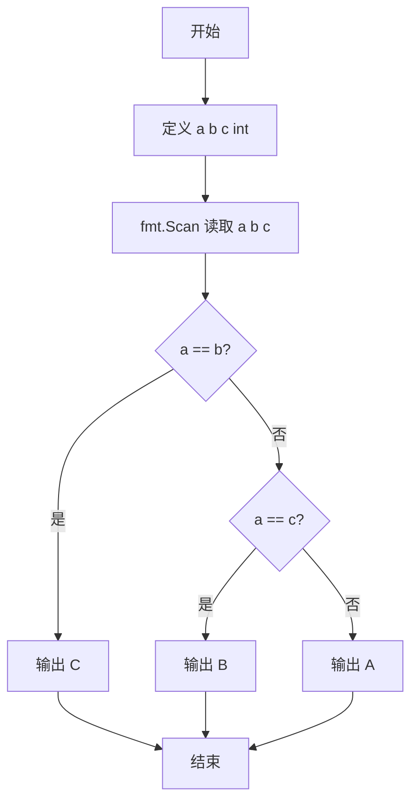
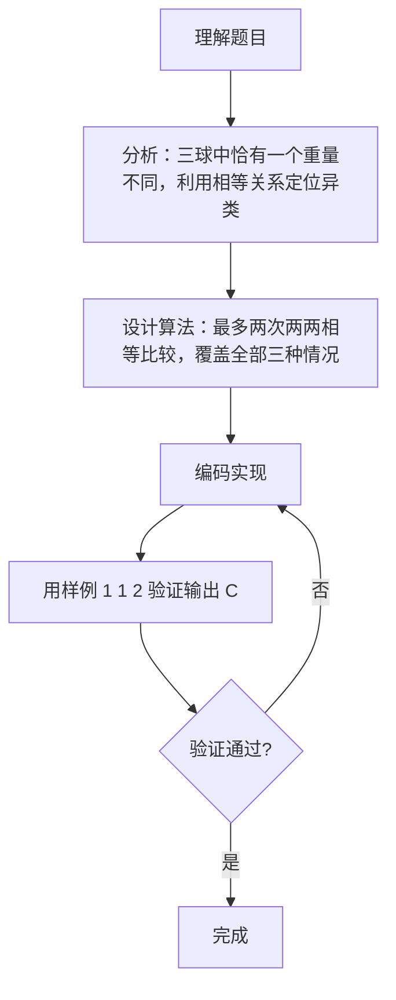

# 7-9 用天平找小球（Go语言实现）

## 前言

这道题给出三个球 A、B、C 的重量，其中恰有一个球的重量与另外两个不同，要求找出这个异类球。

关键前提是"有且仅有两个球重量相等"，由此可以把问题简化为最多两次相等比较。易错点在于必须覆盖 A、B、C 三种异类可能，且输出要使用大写字母。

核心策略是依次比较 A 与 B、再按需比较 A 与 C，即可定位唯一的异类球。

## 题目描述

三个球A、B、C，大小形状相同且其中有一个球与其他球重量不同。要求找出这个不一样的球。

## 输入格式

输入在一行中给出3个正整数，顺序对应球A、B、C的重量。

## 输出格式

在一行中输出唯一的那个不一样的球。

## 输入样例

```in
1 1 2
```

## 输出样例

```out
C
```

## 解题思路

### 1. 利用"恰有一个异类"的前提

三个球（A、B、C）中恰好有一个球与另外两个重量不同，即必有且仅有两个球重量相等。利用这一前提，通过最多两次两两相等比较即可确定异类球的编号。

### 2. 第一次比较：A 与 B

若 a == b，说明 A 和 B 都是正常球，异类必然是 C。

### 3. 第二次比较：A 与 C

若 a != b，则 A 和 B 中必有一个异类，此时再比较 A 与 C：

- 若 a == c，说明 A 与 C 正常，异类是 B；
- 若 a != c，说明 A 与 B、C 都不同，异类就是 A。

逻辑上无需再比较 B 与 C，以上分支已覆盖 A、B、C 三种可能。

## 完整代码

```go
// 题目：7-9 用天平找小球
// 要求：三个球中恰有一个重量不同，找出并输出该球（A、B 或 C）。
//
// 实现原理：
//   1. 读取 a、b、c 三个重量；
//   2. 若 a == b，说明 A、B 同重，异类必为 C；
//   3. 否则若 a == c，异类为 B，反之异类为 A，两次比较覆盖全部情况。
package main

import "fmt"

func main() {
	var a, b, c int
	fmt.Scan(&a, &b, &c)

	if a == b {
		fmt.Println("C")
	} else if a == c {
		fmt.Println("B")
	} else {
		fmt.Println("A")
	}
}
```

## 代码流程说明

1. 导入 fmt 包，提供标准输入输出功能。
2. 定义 a、b、c 三个 int 变量，分别存储球 A、B、C 的重量。
3. 用 fmt.Scan(&a, &b, &c) 按顺序读取三个重量。
4. 判断 a == b：成立说明 A 与 B 同重，输出 C 并换行。
5. 否则判断 a == c：成立说明 A 与 C 同重，输出 B 并换行。
6. 否则 A 与 B、C 均不同，输出 A 并换行。
7. 程序结束，main 函数自然返回。

## 代码流程图



## 解题流程图



## 代码解析

### 读取三个球的重量

```go
fmt.Scan(&a, &b, &c)
```

按顺序把三个正整数读入 a、b、c，分别对应球 A、B、C 的重量。

### 第一层比较

```go
if a == b {
    fmt.Println("C")
}
```

若 A 与 B 重量相等，说明二者都是正常球，唯一异类必为 C。

### 第二层比较

```go
} else if a == c {
    fmt.Println("B")
} else {
    fmt.Println("A")
}
```

A 与 B 不等时二者中必有一个异类：若 A 与 C 相等则 A 正常，异类是 B；若 A 与 C 也不相等，则 A 与 B、C 均不同，异类就是 A。两次比较覆盖全部三种可能。

## 复杂度分析

本题输入规模固定（3 个整数）：

- 时间复杂度：`O(1)`，最多执行 2 次相等比较；
- 空间复杂度：`O(1)`，仅使用 3 个整型变量，无额外空间开销。

## 常见易错点

### 1. 输出字母的大小写

题目要求输出大写的 A、B、C。若输出小写字母或附带引号、空格（如 "C "），均不符合输出要求。

### 2. 比较分支覆盖不完整

若只比较一次就下结论，例如：

```go
if a == b {
    fmt.Println("C")
} else {
    fmt.Println("A")
}
```

输入 1 2 1 时 A、C 同重，异类应为 B，但该代码会输出 A。必须用两次比较覆盖 A、B、C 三种可能。

### 3. 用大小比较代替相等比较

题目只需找出"不一样的球"，不关心偏轻还是偏重。若用 a < b、a > b 之类的大小关系判断，会随异类球偏轻或偏重而得到不同的（错误）结果；相等比较对偏轻、偏重两种情况都适用。

### 4. 读入顺序颠倒

输入顺序对应 A、B、C 的重量。若读入时顺序写反（如 fmt.Scan(&c, &b, &a)），判断的对象与字母对应关系错位，会输出错误的球。

## 更多测试

### 测试一：A 是异类

输入：

```text
2 1 1
```

输出：

```text
A
```

### 测试二：B 是异类

输入：

```text
1 2 1
```

输出：

```text
B
```

### 测试三：C 是异类

输入：

```text
3 3 5
```

输出：

```text
C
```

## 总结

本题的核心是利用"三个球中恰有一个重量不同"这一前提，把问题转化为最多两次相等比较：a 与 b 相等则异类是 C，否则再比较 a 与 c 即可在 B、A 之间定位。这类"从已知前提推导结论"的逻辑判断思路，同样适用于其他寻找唯一异类的题目。
